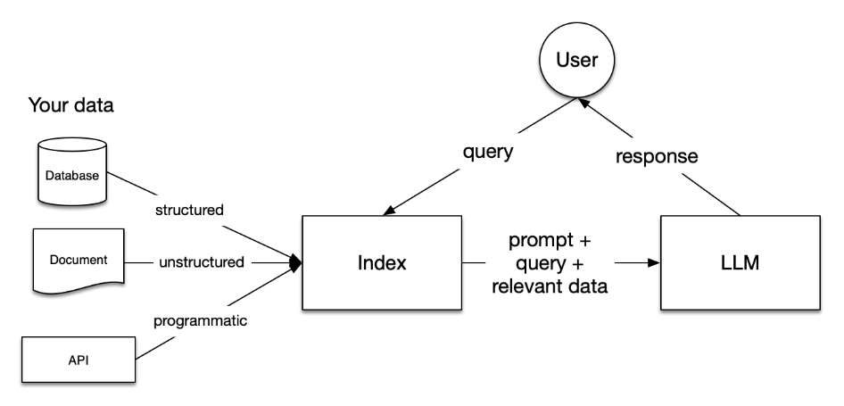
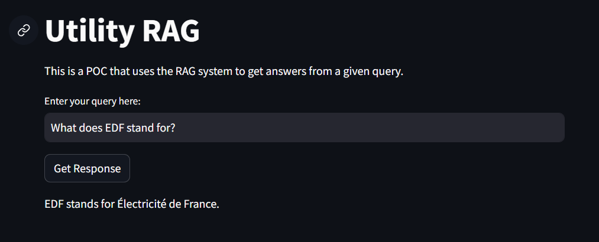
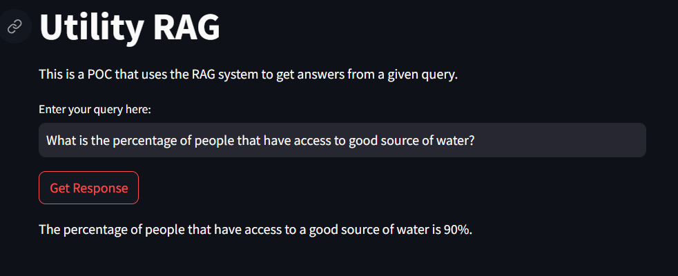
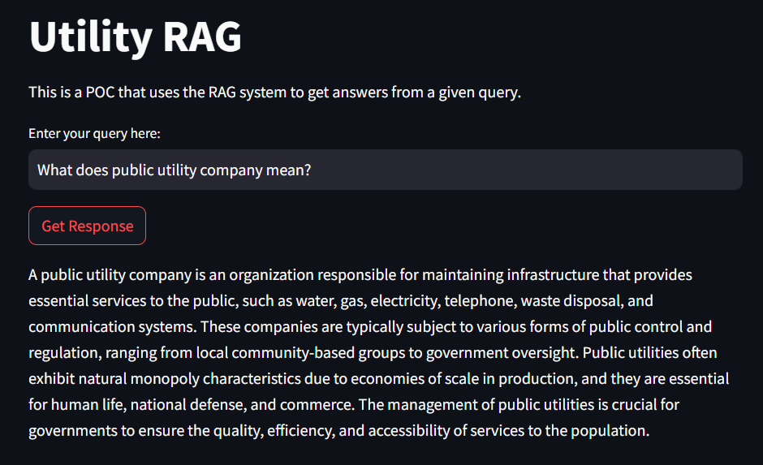
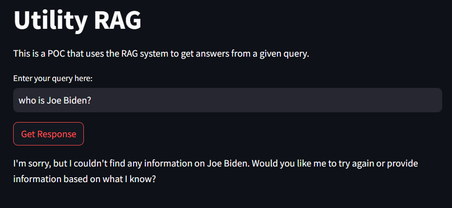

## Introduction

In this repo , I created a simple RAG System that is able to answer questions about custom data. The data used in this project is wikipedia articles about utilities ***(can be found in data folder)***.

## Demo

To use the Demo, you can click [Here](https://avertra-rag.streamlit.app/).

## AI solution architecture

The AI solution is based on the RAG system. The RAG system is a retrieval-augmented generation model that can be used to answer questions about custom data. The RAG system is composed of two main components: a retriever and a generator. The retriever is responsible for retrieving relevant information from a large corpus of text, while the generator is responsible for generating answers to questions based on the retrieved information.

In RAG, your data is loaded and prepared for queries or "indexed". User queries act on the index, which filters your data down to the most relevant context. This context and your query then go to the LLM along with a prompt, and the LLM provides a response.

Even if what you're building is a chatbot or an agent, you'll want to know RAG techniques for getting data into your application.

There are five key stages within RAG, which in turn will be a part of any larger application you build. These are:

* **Loading**: this refers to getting your data from where it lives -- whether it's text files, PDFs, another website, a database, or an API -- into your pipeline.

* **Indexing**: this means creating a data structure that allows for querying the data. For LLMs this nearly always means creating vector embeddings, numerical representations of the meaning of your data, as well as numerous other metadata strategies to make it easy to accurately find contextually relevant data.

* **Storing**: once your data is indexed you will almost always want to store your index, as well as other metadata, to avoid having to re-index it.

* **Querying**: for any given indexing strategy there are many ways you can utilize LLMs and LlamaIndex data structures to query, including sub-queries, multi-step queries and hybrid strategies.

* **Evaluation**: a critical step in any pipeline is checking how effective it is relative to other strategies, or when you make changes. Evaluation provides objective measures of how accurate, faithful and fast your responses to queries are.

### Reranking

**Reranking**, in the context of Large Language Models (LLMs) like the one used in llamaindex, involves adjusting the order of nodes based on their relevance to a query. Here’s a brief overview:

* **Relevance Scoring**: Nodes are initially ranked based on a relevance score, which determines how closely they match the user’s query.
  
* **Reranking Need**: If the initial relevance scores aren’t accurate, reranking techniques can be applied to improve the results.
  
* **Techniques Overview**: Various methods like **LLMRerank**, Cohere, SentenceTransformerRerank, and KeywordNodePostprocessor are used, each with its own approach to reranking.
  
* **Method Selection**: The best reranking method depends on the specific data and requirements of the user; there’s no one-size-fits-all solution.

## Examples

Here are some examples of questions that the RAG system can answer:

* **What does EDF stand for?**

* **What is the percentage of people that have access to good source of water?**
  

* **What does public utility company mean?**

* **who is Joe Biden?**

